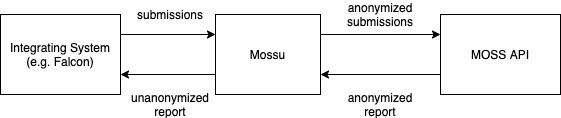
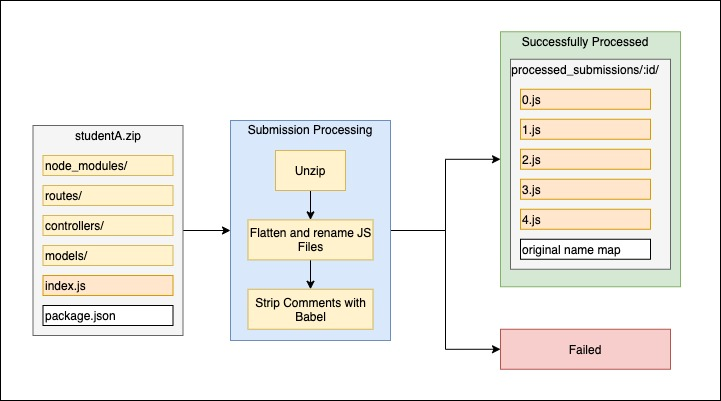

# Mossu

Mossu (aka MOSS Uploader) is a Ruby on Rails application that performs plagiarism checking on Javascript programs.

## Introduction

[Measure of Software Similarity (MOSS)](https://theory.stanford.edu/~aiken/moss/) is an automatic system for determining the similarity of software programs. It is a battle-tested plagiarism checking system used by many institutions. The MOSS system is proprietary (although there is a [whitepaper](https://theory.stanford.edu/~aiken/publications/papers/sigmod03.pdf) on the core algorithm). Student submissions must be uploaded to the MOSS servers to be processed, after which a report in the form of a URL is provided.

As part of my Final Year Project, I was tasked to implement an automated plagiarism checking feature in Falcon, a system used to autograde Node.js web API submissions.

A concern that our project supervisor had was the potential violation of Instruction Manual 8 personal data protections related policies. Student submissions typically contain personal information (name, email, admin number) in the submission zip name and code (as comments).

To work around this, the Mossu system was built. It anonymizes student submissions before submitting them to MOSS.

Here is a high-level overview of how Mossu works and is intended to be used:



## Features

- Anonymizes submissions before submitting to MOSS
- Downloads MOSS report for long-term storage
- Unanonymizes MOSS report
- Designed to allow multiple services to integrate

## API Documentation

Refer to `api.md`

## Requirements

- Ruby 2.6.3
- Rails 6.0.3.4
- Node 10 (for `bin/comment_stripper/`)
- Bash (including `zip`, `unzip`, and `wget`)
- Perl (for `bin/mossnet`)
- Redis
- Postgres

## Set up

Install ruby packages:

```
bundle install
```

Install `bin/comment_stripper/` packages:

```
cd bin/comment_stripper/ && npm install && cd ../../
```

[Register for MOSS](http://moss.stanford.edu/general/moss.html) and put the `mossnet` perl script containing your user id in `bin/mossnet`.

Start the Rails server:

```
bundle exec rails s
```

Start the Sidekiq process:

```
bundle exec sidekiq
```

To start managed processes on production, run:

```
pm2 start ecosystem.config.js
```

## FAQ

### What exactly is being anonymized?

- Zip file name
- Extracted file names
- Javascript comments (with Babel)

Here is a diagram of the submission processing:



### Why is this built as an API?

Mossu is hosted on a Singapore Polytechnic server, and the hope is that eventually services used to host student submissions other than Falcon (e.g. Mimosa) can integrate with it regardless of the language/OS those services are using.
